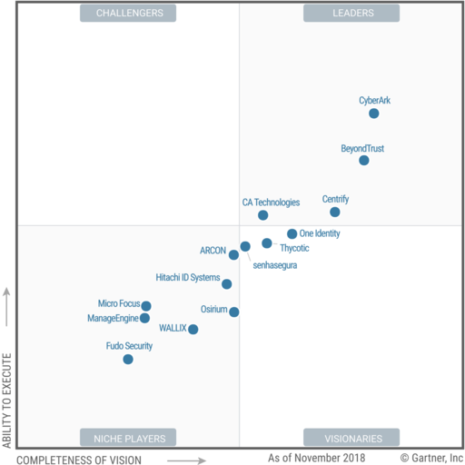
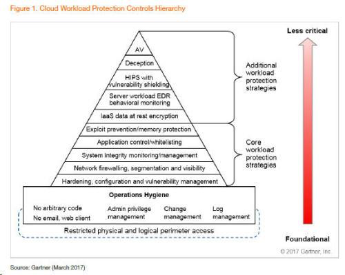

### A brief analysis of the Gartner CWPP market guide

#### Summary
The purpose of this article is to introduce Gartner's Magic Quadrant and Market Guide, as well as Gartner's definition of the cloud security market, to help readers understand the market characteristics and competition.

#### The difference between Gartner's market guide and the magic quadrant
Gartner is a consulting company specializing in the technology market. It conducts competitive analysis on vendors in a certain market. This company has great influence abroad, which leads many companies to refer to Gartner's report when purchasing products to evaluate which vendors’ products are the best.
Gartner's report is mainly in two categories: the Magic Quadrants and the Market Guide. The mature market offers the Magic Quadrant, and the market guide for the immature market. We Can refer to Gartner's official website [^1]：
> As the market continues to evolve and IT solutions are stable but competitive, Gartner Magic Quadrants provide the best tools for understanding supplier positioning; however, when new markets emerge and product and user needs change, solutions are often difficult to compare. Making competitive positioning less useful. Or, when the market matures and the products become interchangeable, the comparative positioning is not as important as the analysis and recommendations of the market itself. In these scenarios, the Gartner Market Guide provides the right insights.
The Magic Quadrant, which ranks the vendor, is divided into two dimensions. The horizontal axis is the product technical capability, and the vertical axis is the market coverage capability. See the example below. [^2]

Market guide, will not rank the vendors, in alphabetical order by name, see the example below [^3]:

#### Definition of CWPP
For the cloud security market, the CWPP (Cloud Workload Protection Platform) cloud security protection model is defined, but Gartner believes that it belongs to the early market, so only the CWPP market guide.
Although CWPP defines cloud security protection, it is essentially a data center security solution, suitable for deployment in a cloud environment, but it is difficult to implement in a traditional physical data center.
CWPP has some changes every year, because the cloud market and technology and security vendors are undergoing profound changes.
- CWPP defined in 2107.
	- It is mainly based on the host security solution, which protects the workload of the server, including physical servers, private cloud servers, and public cloud servers.
	- In the pyramid structure of the solution, the more important it is, the more important is the operation and maintenance security, then the reinforcement, configuration and vulnerability management, until the top is anti-virus.

- CWPP as defined in 2019
	- The defined protection goals not only include containers, but also evolve to serverless workloads at the PaaS layer;

- In the program pyramid, it has been reduced from the original 11 to 8. Among them, a big change is the integration of operation and maintenance security and reinforcement, configuration and vulnerability management.

#### Extended analysis of CWPP definitions

As can be seen from the above definition of CWPP, Gartner believes that for data center security, operation and maintenance security and configuration, hardening and vulnerability management are the most basic and important parts.
Two important findings:
1. Gartner failed to give a plan for collaboration between operations and security. Asset reinforcement, configuration baseline and vulnerability management work, involving operation and maintenance and security are two separate departments, but how to solve it, no advice [^4]:
> These specific steps may be maintained and executed by IT operations (thus the inclusion of this layer in the base). However, information security is responsible for ensuring that systems are hardened and configured according to the organization’s guidelines, and systems are kept patched and up-to-date in a timely manner according to the organization’s policies and industry best practices. 
2. Gartner does not provide a model for operational layer security: Gartner only gives privilege management, change management, log management, email and web client restrictions, asset consolidation, configuration baselines, and vulnerability management, but how these issures are modeled and systematized Solved, failed to give ideas and suggestions.

#### Vendors in the CWPP Market Guide
In the 2019 CWPP market guide, Gartner divided the vendors into seven categories based on a layered approach.
1. Cross-operating system, multi-capacity vendors

2. Vendors for vulnerability scanning and baseline compliance capabilities

3. Application layer firewall, visualization and micro-isolation control

4. Memory and process protection

5. EDR and behavior monitoring, threat detection response

6. Container safety

7. PaaS Serverless Service Security

#### Seeing competition from CWPP model

Data center operation and maintenance and configuration security, reinforcement and vulnerability management, involving the security department, operation and maintenance department, customer lack of management, technical capabilities, from the vendor solutions provided by Gartner, no vendor can provide solutions to customers. 
If some vendor occupies the three layers of account, asset and operation and maintenance operations, it provides a holistic solution compared to single-layer solution vendors, such as Agent-based cloud asset security vendors, cyberspace probe vendors, bastion machine vendors, and privileged account management vendors. There are natural advantages in reducing the impact of peacekeeping.

[^1]:	[Web:Market Guide Research Methodology](https://www.gartner.com/en/research/methodologies/market-guide)

[^2]:	[Web:Gartner Magic Quadrant for Privileged Access Management ](https://www.gartner.com/doc/reprints?id=1-5WGQSGT&ct=181205&st=sb)

[^3]:	[Web:Gartner Market Guide for CWPP 2019](https://www.gartner.com/doc/reprints?id=1-6IQ667E&ct=190412&st=sb)

[^4]:	[Web:Gartner Market Guide for Cloud Workload Protection Platforms ](https://www.gartner.com/doc/reprints?id=1-6IQ667E&ct=190412&st=sb#dv_5_standard_configuration)